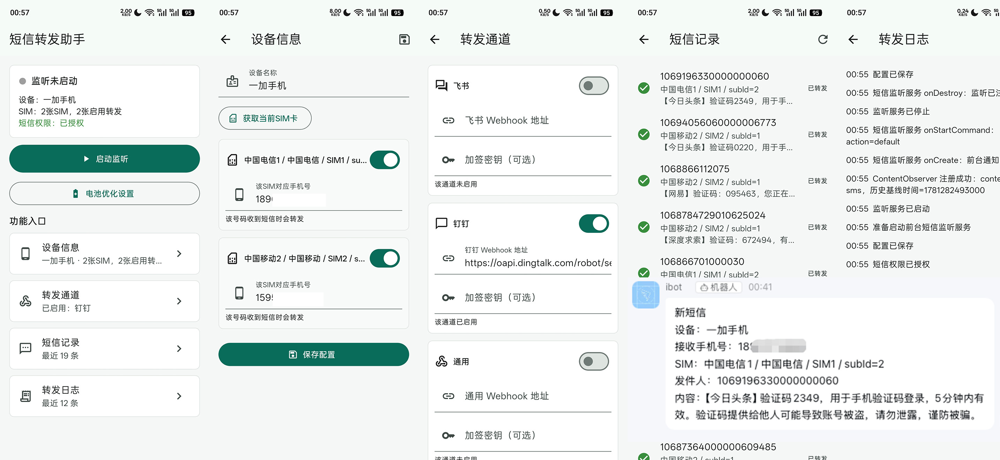

## Android 读取短信内容,并转发至指定接口

很多年前搞了一个 [msgpool](https://github.com/fanfq/MsgPool) , 这几天又让ai给我重新撸了一遍。




**注意** 需要开启权限
- 读取短信
- 耗电管理->完全允许后台行为

## Flutter 3.38.9

```
Flutter 3.38.9 • channel stable • https://github.com/flutter/flutter.git
Framework • revision 67323de285 (5 months ago) • 2026-01-28 13:43:12 -0800
Engine • hash 5eb06b7ad5bb8cbc22c5230264c7a00ceac7674b (revision 587c18f873) (4 months ago) • 2026-01-27 23:23:03.000Z
Tools • Dart 3.10.8 • DevTools 2.51.1
```